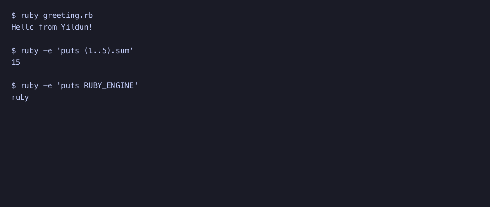

Yildun runs a shell inside a Tarazed-backed terminal session. Use its interactive console for shell input, or capture a terminal screen without a window for scripts and tests.

## Install and launch

You need Ruby **3.1 or newer**. Install the gem and check its version:

```sh
gem install yildun
yildun --version
```

The gem installs its compatible Tarazed dependency. If you use a Gemfile, add `gem "yildun"`, run `bundle install`, and prefix commands with `bundle exec`.

Launch Yildun from an existing terminal:

```sh
yildun
```

Yildun starts the default profile. Unless you change its settings, that is the shell named by `$SHELL`, or `sh` when `$SHELL` is unset, with the `-l` login-shell argument. The session starts in your current directory.

## Run your first command

At the shell prompt inside Yildun, type:

```sh
ruby -e 'puts "Hello from Yildun!"'
ruby -e 'puts (1..5).sum'
ruby -e 'puts RUBY_ENGINE'
```

Press Enter after each command. Their output is `Hello from Yildun!`, `15`, and your Ruby engine name. Type `exit` at the shell prompt to return to the terminal that launched Yildun.



## Capture a screen without a TTY

In a script or CI job, use headless mode:

```sh
yildun --headless --command 'printf "hello\n"' \
  --columns 20 --rows 3 --timeout 1
```

This prints a terminal screen containing `hello`. Output includes blank screen rows; it is a screen snapshot rather than a stream of the child process's output. See [Headless sessions](headless.md) for screen fixtures and scripted input.

## Terminal and platform requirements

The interactive console needs both standard input and standard output connected to a TTY. Run it in a terminal, rather than piping its input or redirecting its output. It uses the terminal's current dimensions and follows window resizing.

The commands in this guide use a POSIX shell on macOS or Linux. Tarazed also has a ConPTY backend for 64-bit Windows. On Windows, configure an installed shell, such as a profile with `"command": ["cmd.exe"]`; the default `sh -l` profile and these POSIX command examples are not Windows shell defaults. ConPTY must be available on the Windows release in use.

## Troubleshooting

| Symptom | What to check |
| --- | --- |
| `Yildun needs a TTY for interactive mode` | Launch from a terminal, or add `--headless` for automated use. |
| Shell cannot be started | Check `$SHELL`, the profile's `command`, and any configured `cwd`. The executable and directory must exist. |
| `invalid settings` | Correct the syntax of `settings.jsonc`. See [Configuration](configuration.md). |
| Headless output is missing or incomplete | Increase `--timeout`, and allow enough `--rows` and `--columns` for the output. |
| Colors or configured font do not appear | The current console renders screen text. Appearance settings are not applied by this renderer. |

Continue with [Interactive usage](usage.md), [Headless sessions](headless.md), or [Configuration](configuration.md).
